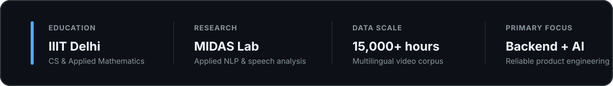
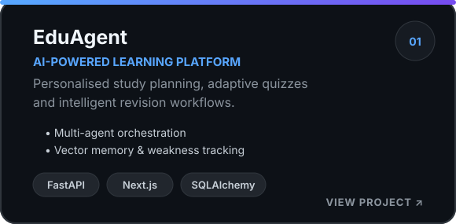
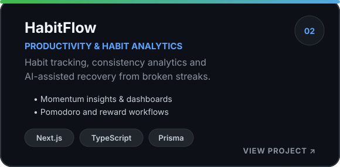
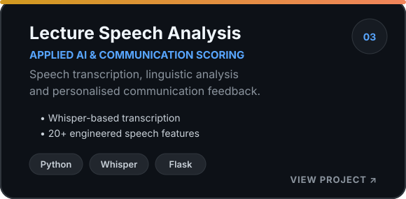
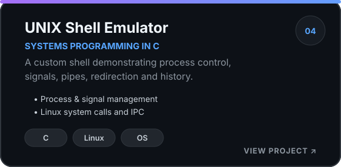

 

 

Profile

I build AI-powered and backend-intensive products with an emphasis on clear architecture, reliable APIs and practical user outcomes.

I am pursuing a B.Tech in Computer Science and Applied Mathematics at IIIT Delhi. My work spans full-stack product development, AI-agent systems, applied NLP and systems programming. I enjoy taking projects from an initial idea to a working product—designing the backend, modelling the data, integrating intelligence and refining the user experience.

Selected Engineering Work

<table>
<tr>
<td width="50%" valign="top">

</td>
<td width="50%" valign="top">

</td>
</tr>
<tr>
<td width="50%" valign="top">

</td>
<td width="50%" valign="top">

</td>
</tr>
</table>

  <a href="https://github.com/dhruv23203?tab=repositories"><strong>View all repositories →</strong></a>

Technical Toolkit

<table>
<tr>
<td width="25%" valign="top">

Languages

C++ Python JavaC TypeScript SQL

</td>
<td width="25%" valign="top">

Backend & Web

FastAPI Next.jsReact Flask REST

</td>
<td width="25%" valign="top">

Data & Persistence

PostgreSQL SQLiteSQLAlchemy Prisma

</td>
<td width="25%" valign="top">

Engineering Foundations

DSA DBMS OSNetworks System Design

</td>
</tr>
</table>

Research & Applied AI

IIIT Delhi · MIDAS Lab

Multilingual NLP Data PipelineBuilt data-processing workflows for transcripts and subtitles across a video corpus representing 15,000+ hours of content, with an emphasis on multilingual extraction and structured downstream use.

AI Lecture Speech AnalysisDeveloped a system using Whisper, engineered speech and linguistic features, and machine-learning models to assess communication quality and generate personalised feedback through a Flask interface.

Current Focus

Designing scalable backend services and stronger system architectures.

Improving advanced DSA, dynamic programming and graph problem-solving.

Building production-oriented AI systems with retrieval, memory and agent orchestration.

Writing clearer documentation, tests and deployment workflows for end-to-end products.

<strong>More about how I work</strong>

 

I value readable code, explicit data models, predictable APIs and product features that solve real user problems. I prefer projects where software engineering and applied intelligence reinforce each other rather than treating AI as an isolated feature.

<strong>Open to collaboration</strong>

 

I am interested in AI-powered education tools, backend platforms, developer productivity products, applied NLP and open-source engineering projects.

GitHub Activity

<picture>
  <source media="(prefers-color-scheme: dark)" srcset="https://raw.githubusercontent.com/dhruv23203/dhruv23203/output/github-contribution-grid-snake-dark.svg"/>
  <source media="(prefers-color-scheme: light)" srcset="https://raw.githubusercontent.com/dhruv23203/dhruv23203/output/github-contribution-grid-snake.svg"/>
  
</picture>

Build thoughtfully. Learn continuously. Ship reliably.

Thanks for visiting. Explore the projects above to see the architecture, implementation and product thinking behind my work.

